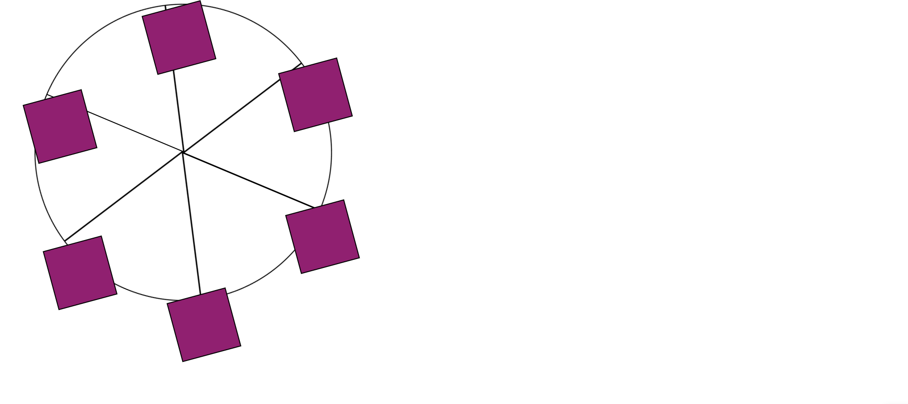

# Ferris Wheel Animation

## Overview

The Ferris Wheel Animation is a creative and interactive web animation that mimics the motion of a Ferris wheel. It features a central wheel with multiple colorful cabins that rotate in a circular motion. The animation is built using HTML and CSS with keyframes for both the wheel and cabins.

## Technologies Used

- HTML5
- CSS3

## How It Works

The Ferris Wheel Animation consists of the following key components:

- **Wheel**: The central wheel is created using a circular `div` element with six spokes (`span` elements) evenly spaced around the wheel. CSS animations (`@keyframes`) are used to rotate the wheel 360 degrees continuously, giving it the appearance of spinning.

- **Cabins**: There are six colorful cabins attached to the wheel. Each cabin is represented as a rectangular `div` element. CSS animations are applied to the cabins to make them change color while rotating along with the wheel. The colors transition from red to yellow to purple and back to red as they move.

- **Layout and Positioning**: The layout and positioning of the wheel and cabins are achieved using CSS positioning and transforms. The cabins are evenly spaced around the wheel, and they rotate around the center of the wheel to create the Ferris wheel effect.

## How to Use

To view the Ferris Wheel Animation, simply open the HTML file (index.html) in a web browser. You can also modify the HTML and CSS to customize the animation's colors, speed, or other properties according to your preferences or integrate it into your own projects.

## Author

- [Chosen Esiwe]
- GitHub: [GitHub Profile](https://github.com/Choboy-dev)

## License

This project is licensed under the MIT License - see the [LICENSE](LICENSE) file for details.

Enjoy the colorful and playful Ferris Wheel Animation!
